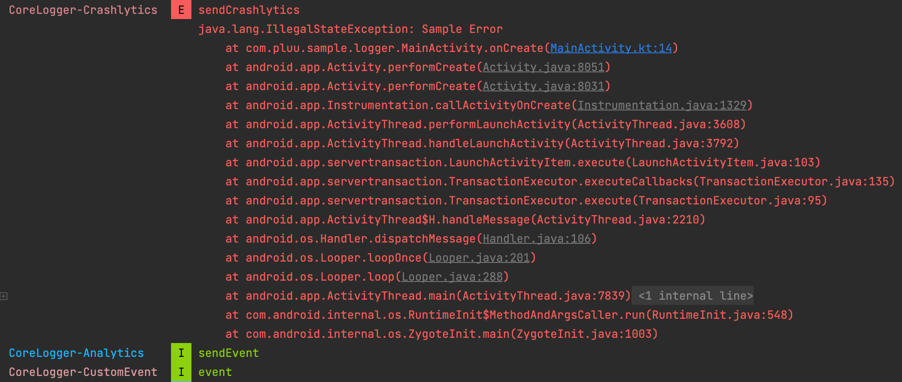

## Sample

```kotlin
// Firebase Crashlytics
CoreLogger.firebase
  .crashlytics
  .sendCrashlytics(/** Exception */)

// Firebase Crashlytics
CoreLogger.firebase
  .analytics
  .sendEvent(/** Key */, /** Value */)

// Custom Event
CoreLogger.customEvent
  .event(/** Custom Event log */)
```

Sample Result



## Initialize

```kotlin
class SampleApp : Application() {
  override fun onCreate() {
    ...
    CoreLogger.config(
      CoreLogger.Config()
        .register(/** Optional, Init Firebase.Crashlytics */)
        .register(/** Optional, Init Firebase.Analytics */)
        .register(/** Optional, CustomEvent */)
    )      
  }
}
```

실제 사용하기 위해서는 Config가 필수 요소
